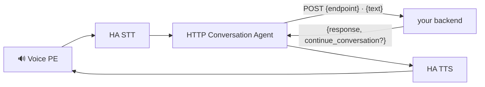

# 🔌 HTTP Conversation Agent

**A Home Assistant conversation agent that forwards every Assist query to any
HTTP backend** — and speaks the backend's reply back through HA's TTS.

---

A small Python custom integration (domain `http_conversation_agent`). It's
**backend-agnostic** — it knows nothing but the minimal contract below, so point
it at anything that speaks it: a self-hosted LLM proxy, an n8n webhook, a FastAPI
service, or the reference backend
[`maxmaxme/voice-assistant`](https://github.com/maxmaxme/voice-assistant).

## 📜 Contract

The backend must speak this minimal HTTP contract:

- **Request** — `POST {base_url}{endpoint_path}`
  - `Content-Type: application/json`
  - `Authorization: Bearer <api_key>` *(only sent when an API key is configured)*
  - body `{"text": "<user utterance>"}`
- **Response** — JSON:
  - `response: string` — text to speak back (required, non-empty)
  - `continue_conversation: bool` — optional; `true` reopens the Assist mic
    without a fresh wake word
- **Health probe** *(optional)* — `GET {base_url}{health_path}` returns `200`.
  Used only by the config flow at setup; leave the path blank to skip it.

That's the whole interface — any backend that wraps its handler in those shapes
works.

## 📦 Installation (HACS)

One click via [My Home Assistant](https://my.home-assistant.io/):

…or manually:

1. HACS → ⋮ → **Custom repositories** → add
   `https://github.com/maxmaxme/ha-http-conversation-agent`, category
   **Integration**.
2. Find **HTTP Conversation Agent** in HACS → Download → restart Home Assistant.
3. Add the integration:

   

   …or Settings → Devices & Services → **Add Integration** → "HTTP Conversation
   Agent".
4. Fill in:
   - **Base URL** — e.g. `http://localhost:3000`
   - **API key** — optional Bearer token (empty for unauthenticated backends)
   - **Conversation endpoint path** — default `/assist`
   - **Health-check path** — default `/health` (blank to skip the setup probe)

## 🎙️ Using it

Settings → **Voice assistants** → pick your pipeline → **Conversation agent** →
"HTTP Conversation Agent". Now every Assist utterance on that pipeline is
forwarded to your backend.

## ⬆️ Migrating from `voice_assistant_bridge` (≤ 0.2.x)

Renamed in 0.3 (`voice_assistant_bridge` → `http_conversation_agent`) to reflect
that any HTTP backend works. HA treats this as a new integration — remove the old
entry in Settings → Devices & Services, then add the new one. Your existing URL +
API key still work as-is (defaults match: endpoint `/assist`, health `/health`).

## 📄 License

[MIT](LICENSE) © 2026 maxmaxme. Permissive on purpose — as a Home Assistant
custom integration it matches the HA ecosystem's norms (HA core is Apache-2.0)
and stays freely reusable.
